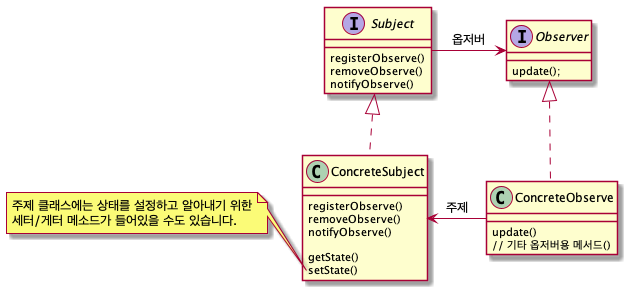

# 옵저버 패턴

##### 옵저버 패턴이란?

옵저버 패턴에서는 한 객체의 상태가 바뀌면 그 객체에 의존하는 다른 객체들한테 연락이 가고 자동으로 내용이 갱신되는 방식으로 일대다(One-To-Many) 의존성을 정의합니다.

##### 책임, 역할, 협력에 관점에서 분석해보기
- 책임
  - subject
    - 옵저버를 관리할 책임을 갖는다.
        - register (등록)
        - remove (삭제)
        - notify (데이터 갱신)
  - observer
    - subject가 주는 갱신된 데이터를 받아 업데이트 할 책임을 갖는다. 

- 협력
  - subject 
    - subject는 추상화인 인터페이스 Observer 퍼블릭 인터페이스에 메세지를 전송함으로 협력을 구현한다.

- 역할
  - Observer 는 update 의 퍼블릭 인터페이스를 제공함으로써 다양한 구현체들이 Observer 를 상속받아 협력에 참여 할 수 있게 한다.

