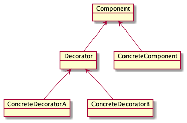

# 데코레이터 패턴

##### 데코레이터 패턴이란?

데코레이터 패턴에서는 객체에 추가적은 요건을 동적으로 첨가합니다. 데코레이터는 서브 클래스를 만드는 것을 통해서 기능을 유연하게 확장할 수 있는 방법을 제공합니다.

##### 책임, 역할, 협력에 관점에서 분석해보기

- 책임

- 협력
    - Component 와 Decorator 는 합성을 사용해 협력을 구현한다.
      - 추가 기능을 구현하기 위해 상속을 사용하면 부모 클래스와 내부적으로 강하게 결합된다.
      - 다양한 기능의 조합을 고려해야 하는 경우에는 각 기능별로 클래스를 만들어야 한다는 단점이 있다.
- 역할
    - Component Decorator 는 모두 추상 클래스 혹은 인터페이스로 구현하여 역할을 부여하고, 구체 클래스로 책임을 구현한다. 

