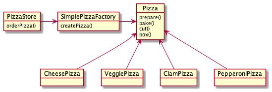

# 팩토리 패턴

##### 팩토리 패턴이란?

객체 생성을 처리하는 클래스를 팩토리라고 부릅니다. OCP를 지키기 위해서 객체 생성하는 책임을 팩토리로 옮겨 코드를 유연하게 작성할 수 있게 합니다.

##### 책임, 역할, 협력에 관점에서 분석해보기

- 책임
    - factory 는 객체 생성의 책임을 갖는다.
- 협력
- 역할
    - PizzaStore(추상클래스), Pizza(추상 클래스)

##### 원칙을 지키는 데 도움이 될만한 가이드 라인

- 어떤 변수에도 구상 클래스에 대한 러퍼런스를 저정하지 맙시다.

new 연산자를 사용하면 구상 클래스에 대한 래퍼런스를 사용하게 되는 것입니다. 팩토리를 써서 구상 클래스에 대한 레퍼런스를 변수에 저장하는 일을 미리 방지합니다.

- 구상 클래스에서 유도된 클래스를 만들지 맙시다.

구상 클래스에서 유도된 클래스를 만들면 특정 구상 클래스에 의존하게 됩니다. 인터페이스나 추상 클래스처럼 추상회된 것으로부터 클래스를 만들어야 합니다.

- 베이스 클래스에 이미 구현되어 있던 메소드를 오버라이드하지 맙시다.

이미 구현되어 있는 메소드를 오버라이드한다는 것은 애초부터 베이스 클래스가 제대로 추상회 된 것이 아니었다고 볼 수 있습니다. 베어스 클래스에서 메소드를 정의할 때는 모든 서브클래스에서 공유할 수 있는 것만 정의해야
합니다. 