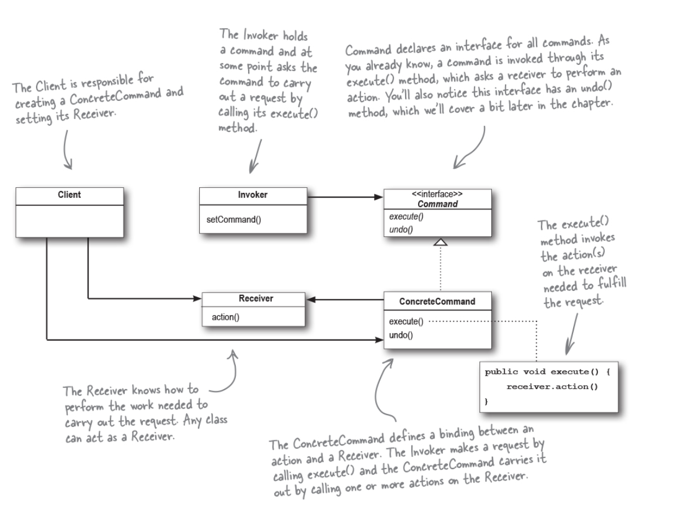

# 커멘드 패턴

##### 커멘드 패턴이란?

실행될 기능을 캡슐화함으로써 주어진 여러 기능을 실행할 수 있는 재사용성이 높은 클래스를 설계하는 패턴입니다. 매개 변수를 써서 여러 가지 요구사항을 집어 넣을 수도 있습니다. 요청 내역을 큐에 저장하거나 로그릴
기록할 수도 있으며 작업 취소 기능도 지원 가능합니다.

##### 책임, 역할, 협력에 관점에서 분석해보기

- 책임
    - Client 는 ConcreteCommand 와 Recevier 를 설정할 책임을 갖습니다.
    - Invokek 는 Command 를 가지고 있으며 execute 메서드롤 호출에 해당 로직을 실행할 책임을 갖습니다.
    - Command 는 모든 커멘드 객체에서 구현해야 하는 인터페이스입니다. 
    - ConcreteCommand 는 특정 행동과 리서버 사이를 연결해줍니다. 
- 협력
- 역할
