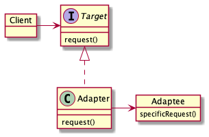
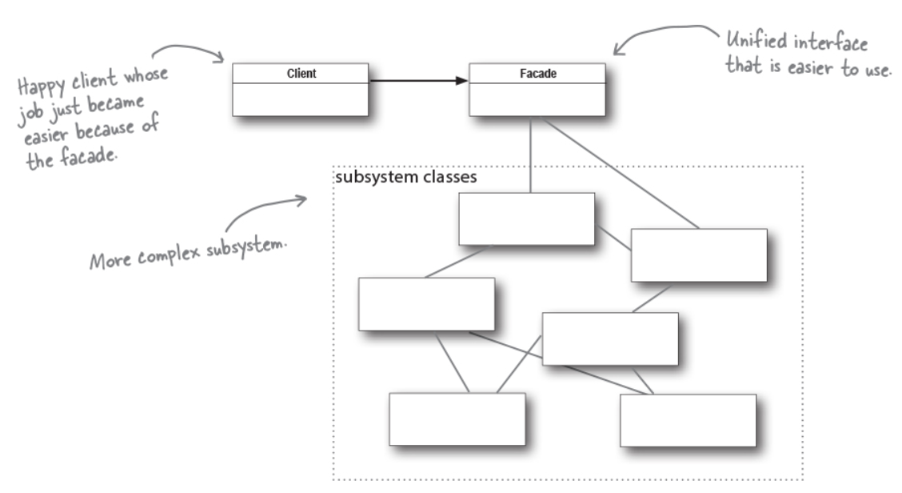

# 어댑터 패턴

##### 어댑터 패턴이란?

한 클래스의 인터페이스를 클라이언트에서 사용하자고 하는 다른 인터페이스로 변환합니다. 어댑터를 이용하면 인터페이스 호완성 문제 때문에 같이 쓸 수 없는 클래스들을 연결해서 쓸 수 있습니다.

##### 책임, 역할, 협력에 관점에서 분석해보기

- 책임
- 협력
    - 클라이언트는 Target 인터페이스에 의존한다.
    - 나중에 인터페이스가 변경되더라도 그 내역은 어댑터에 캡슐화 되기 때문에 클라이언트 코드는 바뀔 필요가 없다.
- 역할
    - 인터페이스를 상속 받아 협력에 참여한다.

# 파사드 패턴

##### 파사드 패턴이란?

어떤 서브시스템의 일련의 인터페이스에 대한 통합된 인터페이스를 제공합니다. 파사드에서 고수준 인터페이스를 정의하기 때문에 서비 시스템을 더 쉽게 사용할 수 있습니다.

##### 책임, 역할, 협력에 관점에서 분석해보기

- 책임
    - Facade 는 서브시스템을 캡슐화하여 클라이언트가 내부 내용을 알지 못하게 한다.
- 협력
    - 클라이언트는 Facade 인터페이스에만 의존하여 협력을 구현한다.
- 역할